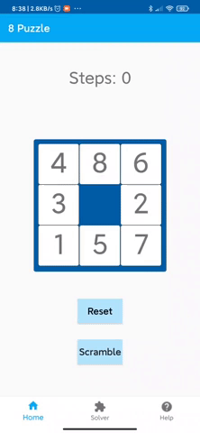
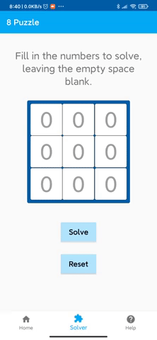

# 8 Puzzle

 

8 puzzle game on Android, with a solver capable of solving any random board. 

You can try playing the puzzle yourself: 

Or find the steps to solve any input board:

# Solver Algorithm
The solver finds the minimum number of moves (the least-cost path) to solve a random input puzzle, using the A* graph searching algorithm, which uses heuristics to guide its search (a best-first search). The heuristic in this algorithm uses the manhattan distance, which is the sum of the displacements of each tile from its solved state. 

The heuristic function in this algorithm uses the sum of the manhattan distance and the number of moves made so far. Intuitively, a move that results in a puzzle with tiles closer to the solved puzzle, and that reaches this state with the least number of moves is the best one. 

The algorithm is implemented using search nodes containing the puzzle state, its priority, and the previous search node. Because each new search node from a new board configuration is the parent of all its neighbouring search nodes, the algorithm essentially uses a tree of paths rooted at the starting position. At each step, all possible search nodes containing adjacent puzzle instances are added to the tree (with their respective priorities), and the one with lowest priority is removed. Once the solved puzzle is reached, the steps are retraced by calling each node's previous search node. 

An algorithm is guaranteed to be optimal if its heuristic is admissible; i.e., the heuristic never overestimates the actual solution's length. Because the algorithm continues to search the lowest priority puzzle state (not necessarily in any order) until the goal state is reached with lowest priority, the route it took to reach the goal must be the optimal solution. 
